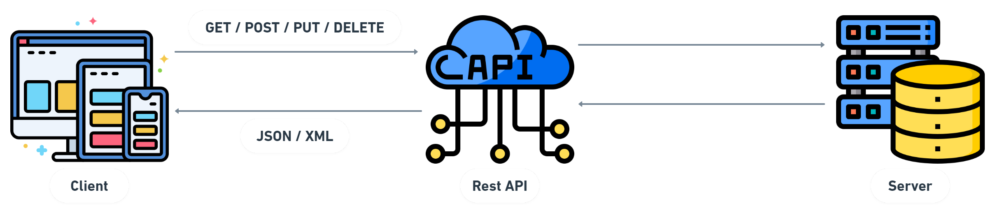

<p align="center">
  
</p><br />

## Teste de backend para a Beta Sistemas

- Um pequeno exemplo de API Restfull utilizando framework **Laravel**,
  - **Observação:** com autenticação do **Passport**.

<br />

<p align="center">
  <a href="#features"> :newspaper: Features</a>&nbsp;&nbsp;|&nbsp;&nbsp;
  <a href="#requisitos">:pushpin: Pré-requisitos</a>&nbsp;&nbsp;|&nbsp;&nbsp;
  <a href="#tecnologias">:computer: Tecnologias</a>&nbsp;&nbsp;|&nbsp;&nbsp;
  <a href="#rodando"> :arrow_forward: Rodando o Projeto</a>&nbsp;&nbsp;|&nbsp;&nbsp;
  <a href="#contribuir"> :jigsaw: Como Contribuir</a>&nbsp;&nbsp;|&nbsp;&nbsp;
  <a href="#licenca"> :memo: Licença</a>
</p>

<br />

<div id="features" align="center">
  <h2> :newspaper: Features</h2>
</div>

- [x] Realiza login com o passport.
- [x] CRUD de categorias:
  - [x] Cria;
  - [x] Lê;
  - [x] Atualiza;
  - [x] Exclui.
- [x] CRUD de produtos:
  - [x] Cria;
  - [x] Lê;
  - [x] Atualiza;
  - [x] Exclui.

<br />

<div id="requisitos" align="center">
  <h2> :pushpin: Pré-requisitos</h2>
</div>

<div id="#" align="center">
  <h4>
    <b>Observação:</b> o Laragon e o Xampp já contém um servidor Apache e um MySQL. Com isso,  não é necessário instalar separadamente o Apache e o MySQL.
  </h4>
</div>

- [Apache](https://www.apache.org/)
- [Composer](https://getcomposer.org/)
- [Git](https://git-scm.com)
- [Laragon](https://laragon.org/) ou [XAMPP](https://www.apachefriends.org/)
- [Laravel](https://laravel.com/)
- [MySQL](https://www.mysql.com/)
- [Postman](https://www.postman.com/)
- [VSCode](https://code.visualstudio.com/)

<br />

<div id="tecnologias" align="center">
  <h2> :computer: Tecnologias</h2>
</div>

- Esse projeto foi desenvolvido com as seguintes tecnologias:
  - Composer;
  - MySQL;
  - Laravel;
    - Passport;
  - PHP.

<br />

<div id="rodando" align="center">
  <h2> :arrow_forward: Rodando o Projeto</h2>
</div>

<div id="#" align="center">
  <h4>
    Siga os seguintes passos para instalar:
  </h4>
</div>

```bash
# clonando o projeto na sua maquina
$ git clone https://github.com/ThaiMedeiros/apirest-laravel.git

# entre na pasta do projeto
$ cd apirest-laravel

# logo depois entre na pasta da API
$ cd api

# 1. copie o arquivo: >> .env.example << cole no mesmo diretório em que se encontra
# 2. remova a extensão >> .example <<
# 3. Então, coloque as credenciais de acesso ao seu banco de dados, no agora arquivo >> .env <<

# inicialize os servidores Apache e MySQL
$ execute o **laragon** ou **xampp** (ou outro servidor web)

# logo após a inicialização, acesse no browser:
$ http://localhost://phpmyadmin (então crie um novo banco de dados)
# Observação: o nome do banco de dados deve ser o mesmo que consta no arquivo .env

# agora, entre na pasta >> api << e para instalar as dependências do projeto, execute:
$ `composer install` ou `composer update` (e aguarde o término)

# para gerar uma chave >> APP_KEY= << criptografada,
# que pode ser usada posteriormente em autenticações se necessário, execute:
$ `php artisan key:generate`

# para rodar as migrações/tabelas no banco de dados
$ `php artisan migrate`

# gerar duas chaves criptografadas no banco para realizar as autenticações
$ `php artisan passport:install`

# Observação: sempre que apagar todas as tabelas do banco de dados,
# rode o >> passport:install << novamente após o >> migrate <<

# caso queria popular o banco de dados para começar as suas requisições, execute:
$ `php artisan db:seed`

# para inicializar, execute no terminal o comando:
$ `php artisan serve`

# poderá acessá-lo através do endereço:
$ `http://localhost:8000`
```

<br />

- Depois de inicializado, já é possível começar os testes! Então, clique: [API](/api)

<br />

<div id="contribuir" align="center">
    <h2> :jigsaw: Como Contribuir</h2>
</div>

1. Faça um fork desse projeto.
2. Crie uma nova branch para trabalhar: `git checkout -b my-feature`
3. Faça commit da sua feature: `git commit -m "feature: My new feature"`
4. Envie as suas alterações: `git push origin my-feature`
5. Solicite uma Pull Request para o diretório original.

<br />

<div id="licenca" align="center">
    <h2> :memo: Licença</h2>
</div>

Esse projeto está sob a licença :balance_scale: MIT License. Veja o arquivo [LICENSE](LICENSE) para mais detalhes.

---

Desenvolvido por: :copyright: Thaiza Medeiros :woman_technologist: :purple_heart:
